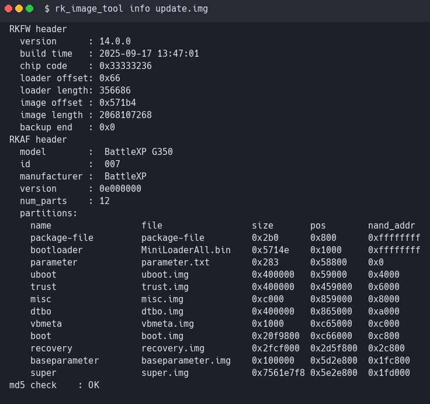
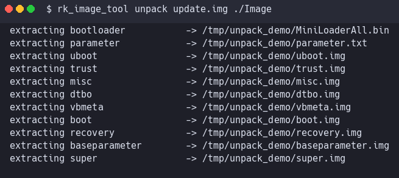
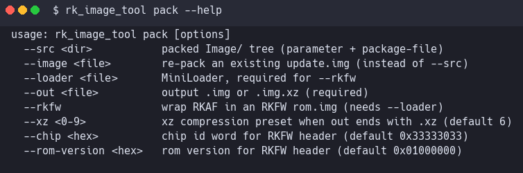
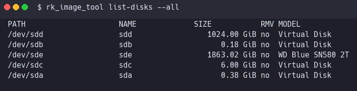
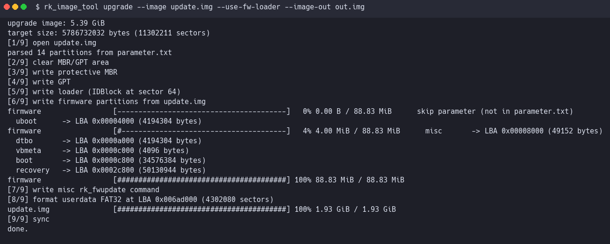
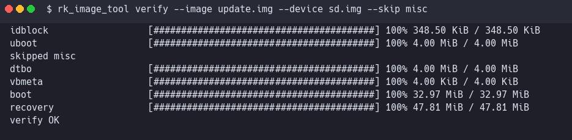
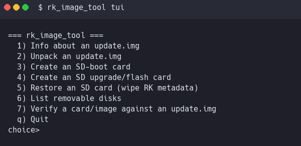

# rk_image_tool

A cross-platform open-source reimplementation of Rockchip's `SD_Firmware_Tool.exe` and the related RK image-packing utilities.

It lets you work with Rockchip firmware images (`update.img`) and create bootable / upgrade SD cards on Windows, macOS and Linux without running the vendor GUI.

> **Status**: v0.2. Full native RKAF/RKFW pack + unpack, SD boot / upgrade card creation, verify pass, streaming `.img.xz` output, VFAT long file names, progress bars, interactive TUI, and static binaries for all platforms. See [ROADMAP](docs/ROADMAP.md).



---

## Features

- Parse and inspect RKFW (`update.img`) and RKAF archives.
- Extract every partition (`boot`, `recovery`, `dtbo`, `super`, `parameter`, ...) into a directory.
- **Native packer** (`pack`): rebuild an `update.img` from an unpacked tree or re-pack an existing image. Optionally wrap as a full RKFW ROM with `--rkfw`.
- Create a Rockchip SD boot card (the "SD Boot" mode of SD_Firmware_Tool).
- Create an SD upgrade / flash card that auto-reflashes the device (the "Upgrade Firmware" mode).
- Restore a Rockchip SD card back to a normal FAT32 removable disk.
- **Verify** a written card or image file byte-by-byte against the source `update.img` with a progress bar.
- **Streaming `.img.xz` output**: write directly into an xz-compressed image file, no intermediate raw image on disk.
- **Auto-sized upgrade image**: in `--image-out` mode the output is sized to exactly what is required (no 16 GiB default blob).
- **VFAT long file names**: `update.img`, `sd_boot_config.config`, etc. appear with their real names on the FAT32 user disk.
- **Progress bars** on long writes (firmware partition copy, `update.img` copy to userdata).
- **Interactive TUI**: `rk_image_tool tui` drives all actions from a menu.
- Optionally write to a disk image file (`--image-out`) instead of a physical SD card, for offline verification or CI.
- Single statically linked binary, no runtime dependencies. Pre-built binaries for Linux x86_64, Linux aarch64, Linux armhf and Windows x86_64.

## Supported platforms

| OS      | Notes                                                    |
|---------|----------------------------------------------------------|
| Linux   | Uses `BLKGETSIZE64` / `BLKRRPART`. Needs root to write.  |
| macOS   | Writes through `/dev/rdiskN`. User must `diskutil unmountDisk` first. |
| Windows | Uses `\\.\PhysicalDriveN` + volume lock/dismount. Run as Administrator. |

## Supported SoCs

Any Rockchip device whose stock upgrade tool is SD_Firmware_Tool v1.69 or earlier: RK3288, RK3328, RK3399, RK3566, RK3568, RK3576, RK356x, RK3399pro and similar. It parses `parameter.txt` from the update image so new partition layouts are handled automatically.

---

## Downloading prebuilt binaries

Grab the relevant single-file binary from the [Releases](https://github.com/TheGammaSqueeze/rk_image_tool/releases) page (or build it yourself below):

| File                                        | Target                       |
|---------------------------------------------|------------------------------|
| `rk_image_tool-0.2.0-linux-x86_64`          | Linux, 64-bit Intel / AMD    |
| `rk_image_tool-0.2.0-linux-aarch64`         | Linux, 64-bit ARM            |
| `rk_image_tool-0.2.0-linux-armhf`           | Linux, 32-bit ARM hardfloat  |
| `rk_image_tool-0.2.0-windows-x86_64.exe`    | Windows, 64-bit              |

Every binary is statically linked and has no runtime dependencies.

## Building from source

```
git clone git@github.com:TheGammaSqueeze/rk_image_tool.git
cd rk_image_tool
cmake -S . -B build -DRK_STATIC=ON
cmake --build build -j
```

Produce statically linked binaries for every supported target in one shot:

```
scripts/dist.sh
ls dist/
```

Cross-compile to a single non-Linux target directly:

```
cmake -S . -B build-win   -DCMAKE_TOOLCHAIN_FILE=cmake/toolchain-mingw64.cmake       -DRK_STATIC=ON
cmake -S . -B build-arm64 -DCMAKE_TOOLCHAIN_FILE=cmake/toolchain-linux-aarch64.cmake -DRK_STATIC=ON
cmake -S . -B build-armhf -DCMAKE_TOOLCHAIN_FILE=cmake/toolchain-linux-armhf.cmake   -DRK_STATIC=ON
```

Run the test suite:

```
ctest --test-dir build --output-on-failure
```

---

## CLI reference

```
rk_image_tool <command> [options]

  info         print header info from an update.img
  unpack       extract partitions from an update.img
  pack         pack an Image/ directory (or existing update.img) back into an update.img / update.img.xz
  sd-boot      create a plain SD-boot card
  upgrade      create an SD upgrade / flash card
  restore      restore an SD card back to a plain FAT32 disk
  list-disks   list removable disks
  verify       read back a disk / image and compare to an update.img
  tui          launch the interactive menu
```

### `info`

```
rk_image_tool info /path/to/update.img
```

Prints RKFW and RKAF header fields and the embedded partition table. Verifies the image MD5.


### `unpack`

```
rk_image_tool unpack /path/to/update.img /path/to/out
```

Extracts every partition into `out/` using the names from `package-file`. Also generates a round-trip-compatible `package-file` for use with `pack`.



### `pack`

```
rk_image_tool pack --src ./Image --out update.img
rk_image_tool pack --src ./Image --out update.img.xz --xz 6
rk_image_tool pack --image old.img --out old-repacked.img            # re-pack an existing image
rk_image_tool pack --src ./Image --loader MiniLoaderAll.bin \
                    --out rom.img --rkfw                             # produce a full RKFW rom.img
```

Produces a byte-compatible `update.img`. `--xz` streams directly into an xz-compressed file with no intermediate raw image.



### `list-disks`

```
rk_image_tool list-disks           # only removable disks
rk_image_tool list-disks --all     # also show fixed disks
```



### `sd-boot`

Writes a Rockchip SD boot card. This makes the device boot from the SD card using the supplied `SDBoot.bin` (or `MiniLoader` from the update image on RK3288).

```
rk_image_tool sd-boot \
  --image   update.img \
  --sdboot  SDBoot.bin \
  --device  /dev/sdX
```

### `upgrade`

Writes an SD upgrade card. Plug the card into the target device and power on; it will self-flash then boot.

```
rk_image_tool upgrade \
  --image   update.img \
  --sdboot  SDBoot.bin \
  --device  /dev/sdX

# or: write to an xz-compressed image instead of a physical card
rk_image_tool upgrade \
  --image        update.img \
  --use-fw-loader \
  --image-out    upgrade.img.xz \
  --xz 6
```

Useful extra flags:

| Flag              | Effect                                                     |
|-------------------|------------------------------------------------------------|
| `--use-fw-loader` | Use the MiniLoader inside `update.img` instead of `SDBoot.bin` (RK3288). |
| `--size-gb <n>`   | Device: cap image size. `--image-out`: override the auto-size. |
| `--image-out <f>` | Write to `.img` or `.img.xz` instead of a physical card.   |
| `--xz <0-9>`      | xz preset when output ends with `.xz` (default 6).         |
| `--no-format`     | Skip the FAT32 format of the userdata partition.           |
| `--demo <file>`   | Copy a demo/asset file alongside `update.img` on the user disk. |
| `--boot-config <f>` | Copy an `sd_boot_config.config` template.                |
| `--label <name>`  | FAT32 volume label (default `RK_UPDATE`).                  |
| `--dry-run`       | Compute the layout and print what *would* be written.      |



### `verify`

Reads back a written card or image and compares every firmware partition to the source `update.img`. Use `--skip misc` when verifying an upgrade card, since upgrade mode intentionally rewrites `misc` with an `rk_fwupdate` command.

```
rk_image_tool verify --image update.img --device /dev/sdX
rk_image_tool verify --image update.img --device upgrade.img --skip misc
```



### `restore`

Clears the Rockchip IDBlock and GPT area and reformats the whole card as FAT32. Reclaims the capacity lost to the hidden loader/firmware partitions.

```
rk_image_tool restore --device /dev/sdX
```

### `tui`

An interactive menu that drives all of the above.

```
rk_image_tool tui
```



---

## Safety

`sd-boot`, `upgrade` and `restore` **will destroy all data** on the target disk. The tool refuses to run without `--device` or `--image-out`. Always double-check with `list-disks`, `lsblk`, `diskutil list` or Disk Management before flashing.

Image-file mode (`--image-out`) is completely non-destructive and is the recommended way to develop / experiment. Every write path accepts both plain `.img` and streaming `.img.xz` output.

## License

Apache 2.0, see [LICENSE](LICENSE). Portions incorporate code originally under 2-clause BSD (Rockchip CRC table by FUKAUMI Naoki). Those files retain their original notices.

## See also

- [`docs/SD_LAYOUT.md`](docs/SD_LAYOUT.md), exact byte layout of an SD card produced by this tool.
- [`docs/FORMAT.md`](docs/FORMAT.md), binary format of `update.img` (RKFW and RKAF).
- [`docs/BUILD.md`](docs/BUILD.md), detailed build instructions.
- [`docs/ROADMAP.md`](docs/ROADMAP.md), next planned features.
- [GitHub wiki](https://github.com/TheGammaSqueeze/rk_image_tool/wiki), walkthroughs and recipes.
